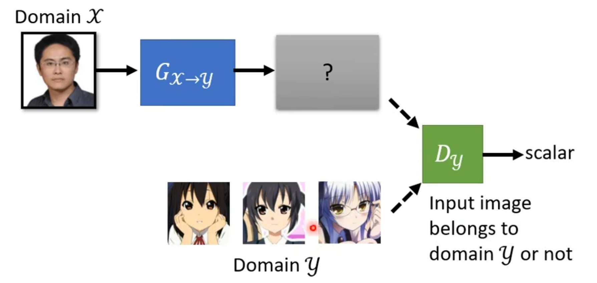
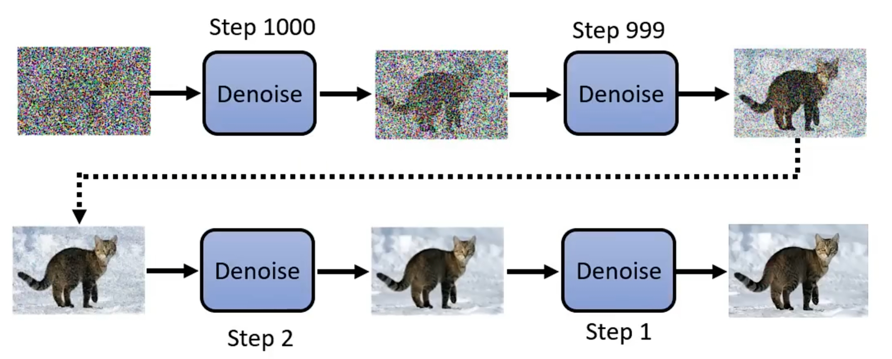
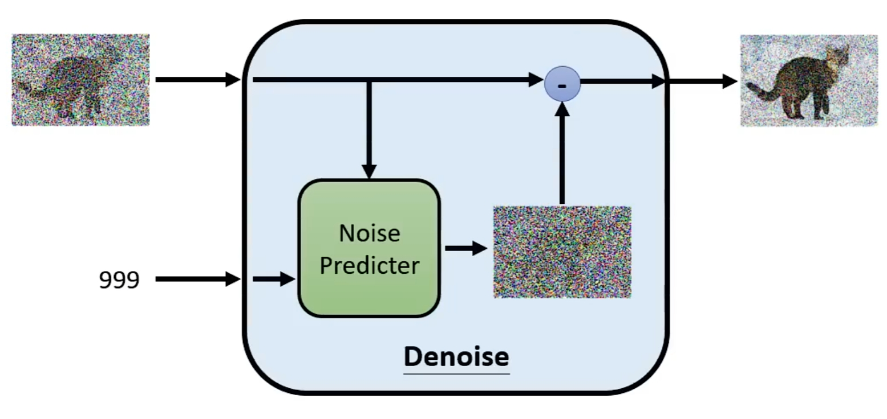
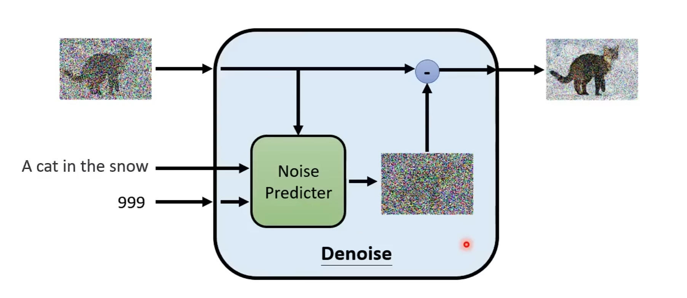
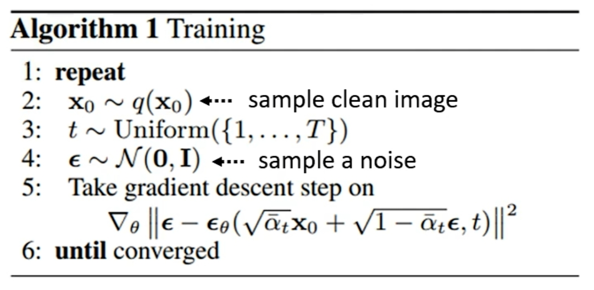

# GAN

## GAN的思路
GAN的训练思路如下：

1. 输入有两种情况：
    
    1. Conditional: 那么输入就是我们的条件 $x$ 和随机采样 $z$ ，其中 $x$ 可以是我们提供的图片或者文字，而 $z$ 一般来讲是在一个随机分布上采样获得的值

    2. Unconditional: 那么输入就只有 $z$

2. 使用 Generator 来产生我们需要的结果，并输入到Discriminator中来计算“好坏”的值，并对Generator进行更新

3. 使用 Discriminator 来判断所它的输出是否是一个*正确的判断*，并对Discriminator进行更新。

4. 重复步骤2和3来进行训练。

## Unconditional
### Discriminator
Discriminator就是用来区分**机器生成**的数据与**真实**的数据的网络，那么它的任务目标就是这个，因此可以将其看作是一种**分类器**，因此我们可以指定Discriminator的Loss Function为CrossEntropy，则其损失函数 $V(D,G)$ 如下：

$$D^{*}=\arg \max_{D}V(D,G)$$

$$V(D,G)=E_{y \sim P_{Data}}[\log D(y)]+E_{y \sim P_G}[\log(1-D(y))]$$

可以发现 $V(D,G)$ 由两部分组成，第一部分表示了对于属于**真实**数据的分类是否正确，第二部分表示对于**生成数据**的分类是否正确。这是**两次**分类，分别对*是否正确判断数据是真实的*和*是否正确判断数据是生成的*这两种判断都加以计算，并不只是二元分类。

但是这种判断Discriminator好坏的方法也是有问题的，如果数据量不够多，或者说生成数据与真实数据的*分布*没有任何重叠部分，则 $V(D,G)$ 的计算结果永远是 $\log 2$ 。更好的判断方式是用 $Wasserstein \; Distance$ 。

## Conditional
### Generator
Conditional的Generator有两个输入——（描述性文字\图片，在某个分布上随机采样的值），输出则是只有一张图片。

### Discriminator
Discriminator的输入也会比Unconditional的情况多一个，即（描述性文字\图片，Generator生成的图片），仅让机器判断输入是否是一个*符合描述，且图片清晰的*是不够的，这种情况下机器要判断**三种**情况：

1. 输入是*符合描述，清晰的*，标记为 $1$
2. 输入是*不符合描述，但是清晰的*，标记也为 $0$
3. 输入是*不符合描述，不清晰的*，标记为 $0$

## GAN在Unsupervised learning中的应用
### Cycle GAN
Cycle GAN的主要应用是图片的风格转换，比如说将一个真实的照片转换至动漫风格的照片，Cycle GAN在训练过程中**是Unsupervised的**。

Cycle GAN的输入（一张照片，在某个分布上的随机采样），输出是（另一种风格的照片）。

如果把*原本风格*的照片看作是一种分布 $\mathcal{X}$ ，而输出的*另一种风格*的照片看作是另一种分布 $\mathcal{Y}$，则Genaerator实际上的任务是找出 $G_{\mathcal{X}\mapsto \mathcal{Y}}$ 这么一种映射方程。Discriminator的任务依然是去*分辨*Generator生成的结果的“好坏”，但是现在的问题是：我们并没有 $\mathcal{X}\mapsto\mathcal{Y}$ 这样一个**一一对应的关系**，我们只知道有这样一个映射，但是不知道映射的对应关系。

这样的数据被称为**Unpaired Data**，那么对于这样的数据，我们别无选择只能使用*无监督学习*，而GAN本身就可以做无监督学习：

因为说到底GAN本身就是通过Generator这样一个函数 $G_{\mathcal{X}\mapsto\mathcal{Y}}$ 将一个 $\mathcal{X}$ 定义域中的数值映射到 $\mathcal{Y}$ 值域中去，而Discriminator做的事情实际上也是判断Generator的输出是否足够“正确的”落在 $\mathcal{Y}$ 中。

但是现在有一个问题就是虽然不做任何改变，即便是Unpaired data，GAN也是可以尝试训练的，但是训练出来的结果可能不尽人意，因为Generator可能会学习到*不合适*的 $G_{\mathcal{X}\mapsto\mathcal{Y}}$ ，虽然这个映射不是错误的，也就是说至少确实是从 $\mathcal{X}$ 映射到了 $\mathcal{Y}$ 的，但是映射的结果也不是我们想要的，

(More content...)

# Diffusion Model
*雕像本来就在石头里，我只是把不要的部分去掉*

*——米开朗基罗*

## Diffusion Model的运作方式
1. 首先采样一个和图片像素大小（e.g. $1024 \times 1024$ ）一样的噪声图片
2. 通过 $N$ 次去噪
3. 得到最终的图片

> 可以看到*去噪器*（Denoise Module）的编号是逐渐减小的

## Denoise Module
输入：
+ 一张带有噪声的图片
+ 去噪器的编号

输出：
+ 去噪后的图片

具体内部的工作原理是：

1. 输入**带噪声的图片**和**去噪器的编号（或者说是去噪的阶段数）**
2. 输入到*噪声预测器*中后得到一张**噪声图**，这张噪声图是*噪声预测器*预测的存在在**输入图片中的噪声**
3. 将输入图片与预测噪声相减得到输出的图片

## Diffusion Model的训练数据

### 噪声预测器(Noise Predictor)的训练
从上面*噪声预测器(Noise Predicter)*的训练过程可以看出，*噪声预测器*的输入数据是需要带有噪声的，且噪声的*程度*还要各有不同，因此我们会通过给一张原始的训练图片不断叠加噪音的方式来生成*噪声预测器*训练数据：

$$Picture^{(k-1)}+Noise^{(k)}=Picture^{(k)}$$

那么根据如上公式，我们在训练模型的时候，就会把 $Picture^{(k-1)}$ 和 $k$ 作为输入，而 $Noise^{(k)}$ 作为输出。

但这个训练是没有任何Prompt的情况，如果需要做到文字到图像（Text-to-Image）的训练，则依然需要成对的训练数据。

### Text-to-Image Diffusion Model的训练
Text-to-Image Diffusion Model实际上还是需要成对的数据的，也就是**输入是文字**，**输出是图片**。

具体到*噪声预测器*的训练，则是：
+ 输入：带噪声图片，去噪阶段数 $N$ ，以及文字嵌入向量
+ 输出：去噪后的图片

## Diffusion Model的模型评价
### FID(Frechet Inception Distance)

FID的计算依赖于一个**已经训练好的CNN分类器网络**。我们会将分类器中Softmax层的**前一层**作为我们计算的向量。

FID计算方式：

1. 将原数据集中的图片放入CNN分类网络中，计算得到许多向量。我们**假设**这些计算得到的向量属于某个**正态分布函数**。
2. 将生成出的图片也放入CNN分类网络中，同样计算得到许多向量。我们同样**假设**这些计算得到的向量属于另一个**正态分布函数**。
3. 计算这两个正态分布函数之间的Frechet Distance，这个距离代表了两个正态分布函数有多**相似**。

### CLIP(Contrastive Language-Image Pre-Training)

## Diffusion Model的原理

