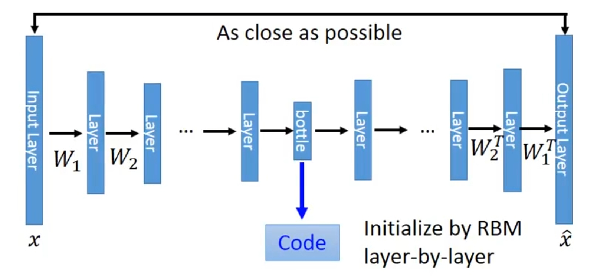
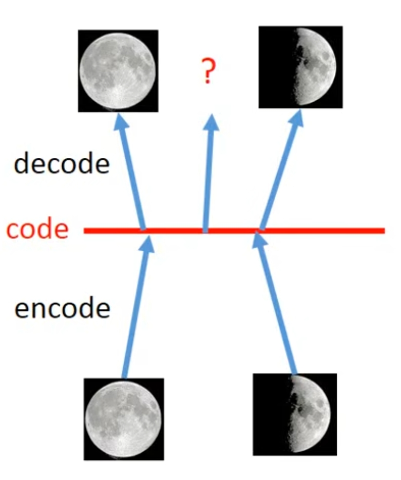

# VAE
## Auto-Encoder

目的：

自动编码器的目的是找到一种编码方式，可以将输入转化成一个比较小的向量，而这个向量的每一个维度都能**控制**输入的某种**特征**， 只需要通过这个编码就能够了解到与输入相关的信息。举例来讲就是假设输入是一张人像，那么Auto-Encoder输出的一个向量，假设是一个10维的向量，那么这个向量的某一个维度可以代表人像的头发长度或者颜色，另一个维度能够代表眼睛的颜色和大小。

因此，Auto-Encoder实际上就是一个能够输出所需*编码*的**神经网络**

> Auto-encoder就是夹在 bottle 与 Input Layer 之间的网络层。

训练方式：

因为我们寻找的是一种编码方式，因此我们会设计这样的层级关系：

输入 $\mapsto$ Auto-Encoder $\mapsto$ 编码 

但是显然我们不可能预先有编码相关的Label，因此做不了Supervised Learning，所以我们会诉诸Unsupervised Learning的方式来训练，既然是Unsupervised Learning，那么就是说我们需要通过输入的内容和输出的内容尽可能一样，因此层级关系就变成了：

输入 $\mapsto$ Auto-Encoder $\mapsto$ 编码 $\mapsto$ Decoder $\mapsto$ 输出（尽可能和输入一样）

当然我们不关心Decoder，这里Decoder只是代表某个神经网络。

## VAE
VAE是Variational Auto Encoder的意思，顾名思义它是Auto Encoder的升级版，那么为什么要对Auto Encoder做升级呢？

目的：

不如从直观一点的角度入手，假设现在我们用有一个对月亮阴晴圆缺变化的Auto Encoder(AE)，比如说code是一个标量，就是个数字，那么我们肯定希望能够通过这个数字来表示月亮的变化，比如说靠近 $1$ 是代表满月，靠近 $0$ 是代表峨眉月。

但是问题是，**AE输出的code并不能做到这样线性的变化**！

为什么AE做不到线性变化？可能的原因是，月相图片的code本身是*非线性的*。

那问题出在哪里了，首先排除Decoder，因为Decoder所做的工作直接去“翻译”code，它并不会影响code线性与否，**那么问题只能出现在Encoder上了**。

因为神经网络实际上就是某种函数：

$$output = f(input)$$

因此，Encoder出现所谓的“问题”，实际上就是在说Encoder所代表的那个函数并不**平滑**，从而导致code的变化不平滑，那么最终导致Decoder的结果是奇形怪状的。

那么如何使生成的函数足够平滑呢？

### 图片平滑操作
我们知道在图片处理中，如果想要让一张图片减小锐利的程度，最简单的做法就是用*高斯模糊*。

实际上，图片的本质就是某种函数，那我们可以干脆把这种思想转移到函数上来——现在我想要一个**平滑的**函数，那我们就直接对函数的输入做一个*高斯模糊*好了。

那我们是对哪个输入做*高斯模糊*，Encoder的输入？还是Decoder的输入，肯定是Decoder的输入，也就是code，为什么不是Encoder的输入？

因为AE的训练是**无监督学习**，也就是说输入和输出必须是一样的，那如果我们最终的目的是**给定不同的code，能够通过Decoder获得一个理想的结果**，我们就不应该在AE的输入上动手脚，这会导致AE的输出也同样被改变。

