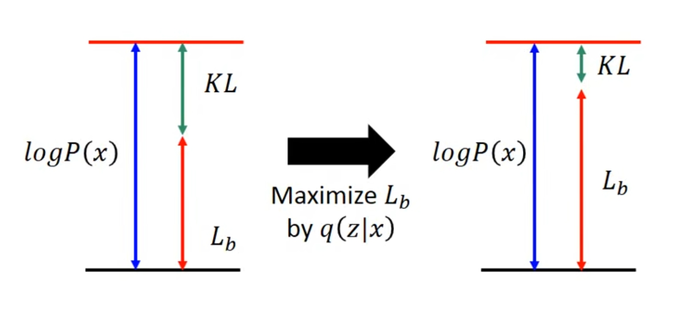

# VAE
## Auto-Encoder

目的：

自动编码器的目的是找到一种编码方式，可以将输入转化成一个比较小的向量，而这个向量的每一个维度都能**控制**输入的某种**特征**， 只需要通过这个编码就能够了解到与输入相关的信息。举例来讲就是假设输入是一张人像，那么Auto-Encoder输出的一个向量，假设是一个10维的向量，那么这个向量的某一个维度可以代表人像的头发长度或者颜色，另一个维度能够代表眼睛的颜色和大小。

因此，Auto-Encoder实际上就是一个能够输出所需*编码*的**神经网络**

> Auto-encoder就是夹在 bottle 与 Input Layer 之间的网络层。

训练方式：

因为我们寻找的是一种编码方式，因此我们会设计这样的层级关系：

输入 $\mapsto$ Auto-Encoder $\mapsto$ 编码 

但是显然我们不可能预先有编码相关的Label，因此做不了Supervised Learning，所以我们会诉诸Unsupervised Learning的方式来训练，既然是Unsupervised Learning，那么就是说我们需要通过输入的内容和输出的内容尽可能一样，因此层级关系就变成了：

输入 $\mapsto$ Auto-Encoder $\mapsto$ 编码 $\mapsto$ Decoder $\mapsto$ 输出（尽可能和输入一样）

当然我们不关心Decoder，这里Decoder只是代表某个神经网络。

## VAE
VAE是Variational Auto Encoder的意思，顾名思义它是Auto Encoder的升级版，那么为什么要对Auto Encoder做升级呢？

目的：

不如从直观一点的角度入手，假设现在我们用有一个对月亮阴晴圆缺变化的Auto Encoder(AE)，比如说code是一个标量，就是个数字，那么我们肯定希望能够通过这个数字来表示月亮的变化，比如说靠近 $1$ 是代表满月，靠近 $0$ 是代表峨眉月。

但是问题是，**AE输出的code并不能做到这样线性的变化**！

为什么AE做不到线性变化？可能的原因是，月相图片的code本身是*非线性的*。

那问题出在哪里了，首先排除Decoder，因为Decoder所做的工作直接去“翻译”code，它并不会影响code线性与否，**那么问题只能出现在Encoder上了**。

因为神经网络实际上就是某种函数：

$$output = f(input)$$

因此，Encoder出现所谓的“问题”，实际上就是在说Encoder所代表的那个函数并不**平滑**，从而导致code的变化不平滑，那么最终导致Decoder的结果是奇形怪状的。

那么如何使生成的函数足够平滑呢？

### 图片平滑操作
我们知道在图片处理中，如果想要让一张图片减小锐利的程度，最简单的做法就是用*高斯模糊*。

实际上，图片的本质就是某种函数，那我们可以干脆把这种思想转移到函数上来——现在我想要一个**平滑的**函数，那我们就直接对函数的输入做一个*高斯模糊*好了。

那我们是对哪个输入做*高斯模糊*，Encoder的输入？还是Decoder的输入，肯定是Decoder的输入，也就是code，为什么不是Encoder的输入？

因为AE的训练是**无监督学习**，也就是说输入和输出必须是一样的，那如果我们最终的目的是**给定不同的code，能够通过Decoder获得一个理想的结果**，我们就不应该在AE的输入上动手脚，这会导致AE的输出也同样被改变。

(Discarded)
======

VAE就是来解决这个问题的，我们很难知道AE的非线性是神经网络哪里出了问题，但是我们现在能知道的是，输入和code是某种意义上*双射*的，而code和输出也是*双射*的，那为了让输出的变化*平滑*一点，我们其实可以考虑加入噪声，或者说联想一下，在图像处理中，如果一张图片太*锐利*了，我们通常的做法就是加一个*高斯模糊*上去，使得画面变得柔和，这里的想法也是一样的，我们给我们的Auto Encoder在输出code之前加入一点高斯噪声，让code的变化不要那么*锐利*。

不过我们也知道，在图像处理中，如果真的只是粗暴的对整张图片使用高斯模糊，那么图片虽然不那么锐利了，但是整张图片也因此模糊的不行，我们希望只在一张图片太锐利的地方，比如说*边缘*，做一些柔化，VAE也是这个想法，我们希望VAE能够主动去学习在code所代表的高维空间中，那些地方需要多加一些模糊，哪些地方要少加一点。下面是VAE的网络结构：

这里的 $m_1,m_2,m_3$ 就是代表原来AE当中生成的code，而VAE增加的部分就是额外输出了一个 $\sigma_1,\sigma_2,\sigma_3$ ，这里的 $\sigma_1,\sigma_2,\sigma_3$ 就是用来控制**噪声的权重**，而 $e_1, e_2, e_3$ 是在正态分布上随机采样的，也就是我们添加的**噪声**，则VAE的编码实际上是：

$$C=M+N\exp(\Sigma)$$

可以看出 $N\exp(\Sigma)$ 就是添加在原来AE输出的编码 $M$ 上的一个噪声。

但是这样的直观理解也过于草率了，数学上的解释是这样的：

我们现在暂时不管Encoder和Decoder，把夹在输入和输出中间的神经网络看作是一个整体，那么我们在做的Unsupervised Learning的任务就是找到符合输入的采样分布的一个函数 $P(x)$ ，那么根据采样求概率分布函数的方法自然就是利用最大似然估计：

$$L=\Sigma_X \log P(x)$$

将这个最大似然估计当作损失函数去训练神经网络。

现在既然我们假设输入的采样是符合某个概率分布模型 $P(x)$ 的，对于这样一个概率分布函数，我们可以使用*Gaussian Mixture Model（高斯混合模型）*，实际上就是用一堆正太分布函数去拟合一个函数。

$$P(x)=\int_ZP(z)P(x|z)dz$$

这里 $P$ 有点混用的嫌疑，等式左侧的 $P(x)$ 当然就是我们想求的概率分布函数，对于等式右边，我们一个一个看，首先是 $P(Z)$ 

$$Z\sim P(z)$$

也就是说 $P(z)$ 服从 $Z$ 的分布，这里 $Z$ 可以是很多种概率分布，一般来讲取**标准正太分布函数**。

$$X|Z\sim N(\mu^z,\Sigma^z)$$

也就是说 $P(x|z)$ 实际上服从 $ N(\mu^z,\Sigma^z)$ 这样一个正太分布，这里的 $\mu^z,\Sigma^z$ 的意思是正态分布的期望和方差是由 $z$ 的取值决定的，也就是代表了高斯混合模型中不同的正太分布。

综合来看就是，我们要求的概率分布函数 $P(x)$ 是由一堆正态分布函数 $P(x|z)$ 积分得来的，而每一个正太分布函数的权重是 $P(z)$ 。

其中 $Z$ 是我们已知的分布不用去求，未知的只有一个 $P(x|z)$ ，而根据最大似然估计我们现在要求 $Maximum \;L=\Sigma_X \log P(x)$ ，也就是说我们只需要让 $P(x|z)$ 最大化就行了。

**但是** $\log P(x)$ 可以被写成如下形式：

$$\begin{aligned}\log P(x) &=\int_Z q(z|x)\log P(x)dz \\\\ &= \int_Z q(z|x)\log \frac{P(x,z)}{P(z|x)}dz \\\\ &= \int_Z q(z|x)\log \frac{P(x,z)}{q(z|x)} \frac{q(z|x)}{P(z|x)}dz \\\\ &= \int_Zq(z|x)\log\frac{P(x,z)}{q(z|x)}dz + \int_Z q(z|x) \log \frac{q(z|x)}{P(z|x)}dz \\\\ &= \int_Zq(z|x)\log\frac{P(x,z)}{q(z|x)}dz + KL(q(z|x)||P(z|x)) \end{aligned}$$

而因为KL距离是一定大于等于0的，因此：

$$\begin{aligned}\log P(x) &\ge \int_Zq(z|x)\log\frac{P(x,z)}{q(z|x)} \\\\ & \ge L_b \end{aligned}$$

如上式，我们设 $L_b=\int_Zq(z|x)\log\frac{P(x,z)}{q(z|x)}$ 为下届，因此继续改写 $\log P(x)$ ：

$$\begin{aligned} \log P(x) &=L_b + KL(q(z|x)||P(z|x)) \end{aligned}$$

我们神奇的发现我们要同时求 $P(x|z)$ 和 $q(x|z)$ ，而且我们发现，因为实际上 $P(x)$ 只跟 $P(x|z)$ 的大小有关，因此我们所有对于 $q(z|x)$ 的调整，实际上是在调整 $L_b$ 和 $KL(q(z|x)||P(z|x))$ 之间的大小关系：

那现在问题是 $q(z|x)$ 是什么东西？实际上 $q(z|x)$ 就是Encoder，为什么，我们将VAE的神经网络展开来看：